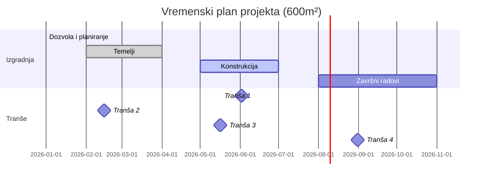

# Uslovi investicionih kredita


## 1. Pregled investicionih kredita

Banke u Srbiji nude **dugoročne investicione kredite** za finansiranje:

- kupovine opreme  
- kupovine ili izgradnje nekretnina  
- proširenja poslovanja  
- infrastrukturnih projekata  

### Tipični uslovi kredita

| Parametar          | Tipične vrednosti                     |
|:-------------------|:--------------------------------------|
| Rok otplate        | 10–15 godina                          |
| Grejs period       | 6–12 meseci                           |
| Valuta             | EUR ili RSD sa valutnom klauzulom     |
| Kamatna stopa      | promenljiva (Euribor/Belibor + marža) |
| Učešće investitora | 20–40% vrednosti investicije          |

Za odobrenje kredita klijent mora imati:

- najmanje **1 godinu pozitivnog poslovanja**
- uredne **finansijske izveštaje**
- dobar **kreditni rejting**
- izmirene **poreske obaveze**

---

<br/><br/>


# 2. Potrebna dokumentacija

Za apliciranje za investicioni kredit potrebna je sledeća dokumentacija.

## 2.1 Osnovna poslovna dokumentacija

| Dokument              | Opis                                         |
|:----------------------|:---------------------------------------------|
| Finansijski izveštaji | Bilans stanja i uspeha za poslednje 2 godine |
| Poreska potvrda       | Potvrda o izmirenim obavezama                |
| Izvod iz APR          | Status firme                                 |
| Kreditni izveštaj     | Provera kreditne istorije                    |

## 2.2 Investicioni projekat

Potrebno je dostaviti detaljan investicioni plan:

- biznis plan ili investicioni elaborat  
- finansijsku projekciju  
- analizu isplativosti projekta  

Ako je projekat **gradnja objekta**, potrebna je dodatna dokumentacija:

- građevinska dozvola  
- glavni projekat  
- izvođački projekat  
- ugovori sa izvođačima  
- urbanističke saglasnosti  

## 2.3 Garancije i finansijska dokumentacija

- popunjen zahtev za kredit  
- blanko menice  
- jemstvo vlasnika ili uprave  
- izjava o zaduženju  

---

<br/><br/>


# 3. Kriterijumi koje banke procenjuju

Banke procenjuju projekat kroz nekoliko ključnih parametara.

## 3.1 Učešće investitora

| Parametar          | Tipično |
|:-------------------|:--------|
| Učešće investitora | 20–40%  |
| Kredit banke       | 60–80%  |

## 3.2 LTV (Loan-to-Value)

| Tip projekta        | Tipični LTV |
|:--------------------|:------------|
| Završena nekretnina | 70–80%      |
| Nedovršeni objekti  | niži LTV    |

## 3.3 DSCR (Debt Service Coverage Ratio)

Banke procenjuju:

- da li projektovani prihod može pokriti rate kredita  
- da li kredit ugrožava likvidnost firme  

## 3.4 Osiguranje

Obavezno:

- osiguranje objekta  
- osiguranje opreme ili vozila  
- ponekad životno osiguranje vlasnika  

---

<br/><br/>


# 4. Obezbeđenje kredita

Banke zahtevaju **više slojeva obezbeđenja**.

## 4.1 Najčešći instrumenti

| Instrument            | Opis                        |
|:----------------------|:----------------------------|
| Hipoteka              | Prva hipoteka na nekretnini |
| Zalog opreme          | Zalog mašina ili vozila     |
| Blanko menice         | Menice kompanije i vlasnika |
| Garancije trećih lica | vlasnici ili povezane firme |

## 4.2 Dodatna obezbeđenja

- depozit u banci  
- procena vrednosti kolaterala  
- vinkulacija osiguranja u korist banke  

Sve troškove:

- procene  
- upisa hipoteke  
- osiguranja  

snosi **zajmoprimac**.

---

<br/><br/>


# 5. Cena kredita

## 5.1 Kamatne stope

Najčešći model:

```
3M Euribor + marža banke
```

Primeri marži:

| Banka        | Primer marže |
|:-------------|:-------------|
| Raiffeisen   | oko 6–8%     |
| OTP          | oko 8%       |
| ostale banke | 4–8%         |

## 5.2 Naknade

| Naknada            | Tipično   |
|:-------------------|:----------|
| Obrada kredita     | oko 1%    |
| Procena nekretnine | 200–500 € |
| Notarske takse     | 300–500 € |
| Upis hipoteke      | 200–400 € |

## 5.3 Efektivna kamatna stopa (EKS)

EKS uključuje:

- kamatu  
- naknade  
- osiguranje  

Tipično:

```
≈ 14–25%
```

---

<br/><br/>


# 6. Fazno finansiranje (tranše)

Kod građevinskih projekata banke često koriste **tranšno finansiranje**.

## 6.1 Kako funkcionišu tranše

Novac se isplaćuje po fazama gradnje:

| Faza   | Opis                                 |
|:-------|:-------------------------------------|
| Faza 1 | građevinska dozvola / početak radova |
| Faza 2 | završetak temelja                    |
| Faza 3 | završetak konstrukcije               |
| Faza 4 | završni radovi i upotrebna dozvola   |

Za svaku tranšu potrebno je:

- izveštaj nadzora  
- fakture izvođača  
- potvrda o napretku radova  

Banke često:

- vrše inspekciju gradilišta  
- isplaćuju novac direktno izvođačima  

---

<br/><br/>


# 7. Proces dobijanja kredita

Proces obično traje **1–3 meseca**.

## Koraci procesa

### 1. Pred-priprema

- kontakt sa bankom  
- inicijalna procena projekta  

### 2. Podnošenje zahteva

Dokumentacija:

- finansijski izveštaji  
- projekat  
- dozvole  
- plan finansiranja  

### 3. Analiza banke

Banka radi:

- finansijsku analizu  
- pravnu analizu  
- procenu kolaterala  

### 4. Odluka i ugovor

- kreditni odbor donosi odluku  
- potpisuje se ugovor  
- registruje se hipoteka  

### 5. Isplata kredita

- prva tranša  
- dalji monitoring projekta  

---

<br/><br/>


# 8. Rizici projekta

## 8.1 Građevinski rizik

Problemi:

- kašnjenje radova  
- rast cena materijala  

Ublažavanje:

- rezervni budžet (10–15%)  
- fiksni ugovori sa izvođačima  

## 8.2 Tržišni rizik

- pad cena nekretnina  
- pad potražnje  

Ublažavanje:

- niži LTV  
- veće sopstveno učešće  

## 8.3 Kamatni rizik

Promenljiva kamata može povećati ratu.

Rešenje:

- pregovaranje marže  
- hedging instrumenti  

## 8.4 Likvidnost

Ako projekat ne generiše prihod:

- banka može aktivirati hipoteku  
- menice  
- garancije vlasnika  

---

<br/><br/>


# 9. Primer finansiranja (600 m² zgrada)

## Osnovne pretpostavke

| Parametar          | Vrednost  |
|:-------------------|:----------|
| Ukupna investicija | 600.000 € |
| Kredit banke       | 420.000 € |
| Učešće investitora | 180.000 € |
| Učešće             | 30%       |
| Kredit             | 70%       |

## Raspored tranši

| Faza projekta  | % projekta | Tranša kredita | Iznos kredita | Učešće klijenta |
|:---------------|:-----------|:---------------|:--------------|:----------------|
| Početak radova | 0%         | 20%            | 84.000 €      | 36.000 €        |
| Temelji        | 25%        | 20%            | 84.000 €      | 21.000 €        |
| Konstrukcija   | 70%        | 30%            | 126.000 €     | 24.000 €        |
| Završni radovi | 95%        | 20%            | 84.000 €      | 49.000 €        |
| **Ukupno**     | 100%       | **100%**       | **420.000 €** | **180.000 €**   |

---

<br/><br/>


# 10. Primer vremenskog plana



---

<br/><br/>


# 11. Izvori

Podaci su preuzeti sa sajtova banaka i industrijskih izvora:

- Intesa  
- Raiffeisen  
- OTP  
- NLB  
- Erste  
- API Banka  

Gde konkretni zahtevi nisu javno objavljeni, korišćeni su **standardni bankarski modeli finansiranja investicionih projekata u Srbiji**.

---

<br/><br/>


