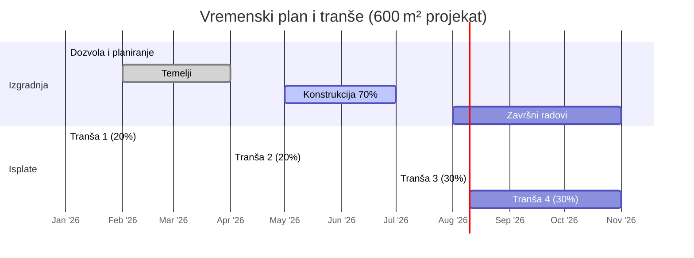

# Investicionih kredita u Srbiji

Banke u Srbiji nude **dugoročne investicione kredite** za ulaganja u osnovna sredstva (oprema, nekretnine, izgradnja) i rast poslovanja.
Krediti se obično daju na rok od 10–15 godina, uz mogućnost 6–12 meseci grejs perioda za glavninu kredita【49†L450-L458】【57†L30-L34】.
Za odobrenje je neophodno da pravno lice ili preduzetnik ispuni niz uslova:
- najmanje godinu dana pozitivnog poslovanja,
- uredne finansijske izveštaje,
- dobar kreditni rejting i
- redovno izmirene poreze i doprinose【41†L19-L27】【46†L285-L293】.

Projekti se moraju detaljno dokumentovati:
uključujući poslovni plan, građevinsku dozvolu i tehničku dokumentaciju objekta. 
Banke traže da investitor učestvuje sa sopstvenim sredstvima (često **20–40%** ukupne vrednosti investicije)【41†L75-L83】【46†L285-L293】.  

Za obezbeđenje kredita banke zahtevaju kreditnu garanciju i hipoteke na nekretninama. 
Tipično se polaže **prva hipoteka** na zemlju ili objekat koji se gradi, uz naplatu procene od licenciranog procenitelja【43†L119-L124】. 
Obavezne su i blanko menice (za kompaniju i/ili fizička lica) kao dodatna garancija【43†L115-L124】. 
Dopušteno je i zalaganje osnovnih sredstava (mašina, vozila) uz odgovarajuću dokumentaciju. 
Kamatne stope su uglavnom **promenljive** (npr. 3M Euribor/Belibor + marža banke) – Raiffeisen navodi primer marginama od oko 6–8% na taj pokazatelj【43†L104-L112】. 
Uz to, banka naplaćuje početne provizije (npr. ≈1% iznosa) i takse za procenu i registrovanje hipoteka【43†L127-L130】. 
Efektivna kamatna stopa (EKS) tipično je u srednjim do visokim dvadesetim procentima zbog ovih troškova.  

Za projekte izgradnje objekata banke često nude **fazno (tranširano) finansiranje**. 
Na primer, NLB eksplicitno omogućava isplatu kredita „u tranšama” po završetku ključnih etapa izgradnje【49†L454-L462】. 
Slično tome, API Banka navodi da isplata može biti „jednokratno u tranšama” na račun klijenta【52†L253-L261】. 
To znači da se sredstva isplaćuju po fazama – npr. na osnovu završetka temelja, konstrukcije, završnih radova i izdavanja upotrebne dozvole. 
Za svaku tranšu potrebno je pribaviti potvrdu o završenoj fazi (izveštaj građevinskog nadzora, fakture, i sl.) i eventualno nove procene vrednosti kolaterala. 
Banka vrši inspekciju gradilišta ili zahteva overene izveštaje pre svake isplate.

Proces dobijanja kredita traje obično nekoliko nedelja. 
Klijent prvo podnosi zahtev uz svu dokumentaciju (finansijski izveštaji, plan projekta, dozvole). 
Banka zatim vrši analizu (finansijsku, pravnu, proceniteljsku). 
Po odobrenju se zaključuje ugovor, nakon čega se ispunjavaju uslovi (registracija hipoteka, plaćanje taksi, otvaranje računa). 
Tek onda sledi prva isplata (prva tranša). 
Svaka naredna tranša plaća se po proveri ispunjenja uslova. 

Rizici poput prekoračenja budžeta ili promena tržišta ublažavaju se kombinacijom adekvatnog učešća i bankarskih mehanizama. 
Banka ima pravo da prekine isplate ako projekat nije na planu, da traži dodatno obezbeđenje ili da aktivira menična jemstva u slučaju neizmirenja. 
Investitor bi trebalo da planira finansijsku rezerve (10–15% projekta) i ugovara fiksne cene sa izvođačima kako bi smanjio rizik.

---

## Uslovi i potrebna dokumentacija

- **Pravna forma:** Kredit mogu dobiti pravna lica (d.o.o., preduzeća, zadruge) i registrovani preduzetnici. Banke poput Intese zahtevaju najmanje 15 meseci poslovanja preduzetnika【41†L19-L27】.
- **Uređenost poslovanja:** Potrebni su čisti finansijski izveštaji (bilans stanja, uspeha) za najmanje poslednje dve godine, kao i potvrda o izmirenim poreskim obavezama.
- **Investicioni plan:** Detaljni biznis plan ili investicioni elaborat sa namerom korišćenja sredstava, finansijskom prognozom i analizom isplativosti【46†L285-L293】.
- **Građevinska dozvola i tehnička dokumentacija:** Ako se gradi objekat, obavezna je valjana građevinska dozvola i kompletnan projekat (glavni i glavni izvođački plan objekta).
- **Dozvole i ugovori:** Ugovori sa izvođačima radova, dozvole i saglasnosti ako su potrebni (npr. saglasnost urbanističke inspekcije, legalizacija, itd.).
- **Garancije:** Popunjen zahtev za kredit, menični zahtevi (blanko menice i jemstvo) i eventualna izjava o zaduženju u korist banke.
- **Minimalni kapital:** Neke banke zahtevaju minimalni kapital firme (npr. Intesa «dovoljno sopstvenih sredstava», OTP zahteva minimalni kredit od 5.000 EUR uz sopstveni udeo od 20%【46†L285-L293】).

## Kriterijumi banke (odobravanje kredita)

- **Učešće (equity):** Banke obično zahtevaju da investitor ima sopstveno učešće od oko **20–40%** vrednosti investicije【41†L75-L83】【46†L285-L293】. U praksi to znači da se kredit kreće do ~60–80% ukupnih troškova.
- **LTV (Loan-to-Value):** Odnos kredita i vrednosti kolaterala. Za dovršene nekretnine banke često postavljaju LTV oko **70–80%**. Za nedovršene objekte i opremu se može zahtevati veći udeo investitora (niži LTV), ali konkretni limit zavisi od banke.
- **Tokovi novca (DSCR):** Banke interno proveravaju pokrivenost duga projektovanim prihodima (Debt Service Coverage Ratio). Tačni zahtevi se ne objavljuju, ali podrazumevano je da očekivani neto prihod pokriva ratu kredita uz rezervu. Ključno je da novi kredit ne naruši likvidnost firme.
- **Osiguranje:** Obavezno je osiguranje objekta (od požara, elementarnih nepogoda) koje je banki na uvid ili preneseno na banku. Vozila ili oprema u zalogu moraju imati potpunu kasko-polisu. Dodatno, banka može zahtevati policu osiguranja života ili kreditnu polisu kao još jedno sredstvo obezbeđenja.
- **Ostali zahtevi:** Pozitivan kreditni izveštaj u CRIF-u, minimalna starost preduzetnika, zaposlenost menadžmenta, itd. Za projekte uz međunarodnu finansijsku podršku mogu važiti i specifični zahtevi (npr. transparentnost trošenja sredstava).

【41†L19-L27】【41†L75-L83】【46†L285-L293】

## Obezbeđenje i garancije

Banke zahtevaju čvrsto obezbeđenje za investicioni kredit:

- **Hipoteka:** Prvi teret (hipoteka prve ranke) na nekretninu koja se gradi ili na drugu nekretninu dužnika【43†L119-L124】. Nekretnina mora imati čistu vlasničku papire i vrednost procenu od licenciranog sudskog veštaka.
- **Zalog opreme/vozača:** Ako je kredit za opremu ili vozila, banka uzima zalog na njih (uz procenu i osiguranje)【43†L119-L124】.
- **Blanko menice i jemstvo:** Standardno se traže blanko menice sa jemstvom lica iz uprave (osnivača)【43†L115-L124】. One omogućavaju brzo aktiviranje obećanja o plaćanju.
- **Garancije trećih lica:** Fizička lica (vlasnici, vlasnici kompanija) i/ili povezane firme mogu dati dodatne garancije. Ovakve garancije (direktna ili virmanja) povećavaju šansu za odobrenje većih iznosa.
- **Depozitno obezbeđenje:** Neke banke nude opciju da se kredit pokrije keš depozitom (plaćenim iznosom u banki).
- **Procena nedovršene vrednosti:** Za zalog na građevini u toku, banka može proceniti samo procenat završenosti (npr. objekat 80% građen, vrednovan kao da je 100% put u završenom stanju). Ta procena se prilagođava po slučaju.
- **Osiguranje i troškovi:** Polise osiguranja nad zalogom moraju biti vezane za banku (vinkulirane). Troškove upisa hipoteke i osiguranja snosi zajmoprimac.

【43†L115-L124】

## Uslovi kredita i cena

- **Valuta:** Krediti mogu biti u **dinarskoj** (često sa valutnom klauzulom za EUR) ili direktno u **evrima**【57†L22-L25】.
- **Rok otplate:** Obično do 10 godina za mala preduzeća. Intesa i OTP nude do 10 godina【57†L30-L34】【46†L285-L293】, dok NLB omogućava i do 15 godina【49†L450-L458】. Za projekte zelenih ulaganja rok može biti i do 15 godina.
- **Grejs period:** Mogući grejs period za glavninu kredita (npr. do 6–12 meseci) kod ulaganja u izgradnju【49†L450-L458】【57†L30-L34】. OTP npr. dozvoljava do 9 meseci počeka【46†L285-L293】.
- **Kamatna stopa:** Uglavnom **promenljiva**, npr. 3M Euribor ili Belibor + marža. Prezent rešenja Raiffeisena spominju maržu do 7,85% + 3M Belibor ili 6% + 3M Euribor【43†L104-L112】. OTP u primerima koristi i 3M Belibor + 8%. Marže su viši za manje firme (uglavnom 4–8%).
- **Naknade:** Obično se plaća obrada kredita oko 1% iznosa (min. npr. 100€)【43†L127-L130】. Plaćaju se i takse za procenu nekretnine, overu menica i upis hipoteke (npr. notarske takse, upravne takse ~ €600–900).
- **EKS (Efektivna stopa):** Zbog početnih naknada, EKS kredita iznosi često *sredinu dvadesetih procenata*. OTP primer navodi **14,52% EKS** za 10-godišnji kredit (80.000 RSD)【46†L335-L343】. Treba proveriti EKS svake ponude, jer ona obuhvata kamatu, naknade i osiguranje.

Citate: 【43†L104-L112】【43†L127-L130】【49†L450-L458】【57†L30-L34】

## Fazno finansiranje (tranše)

Mnoge banke finansiraju gradnju tranšama po fazama:

- **Primeri banaka:** NLB u uslovima ističe *“mogućnost isplate … u tranšama”* za investicioni kredit【49†L454-L462】. API Banka navodi da je isplata “jednokratno u tranšama” na račun klijenta【52†L253-L261】. To potvrđuje da je praksa plaćanja po fazama uobičajena.
- **Faze projekta:** Tranše obično prate ključne završetke građevine. Tipična podela je:
  - **I faza:** Dozvola ili temelji – banka može isplatiti deo nakon dobijanja građevinske dozvole i početka radova.
  - **II faza:** Završen rož-konstrukcija (krov) – nakon što je objekat zatvoren (50–80% radova).
  - **III faza:** Fasada/instalacije – završetak kritičnih instalacija i spoljašnjeg omotača (~80–90%).
  - **IV faza:** Upotrebna dozvola i završetak – preostali završni radovi, izdavanje upotrebne dozvole.
- **Dokumentacija za tranše:** Za svaku tranšu banka zahteva dokaz o napretku radova: inženjerski ili građevinski izveštaj, potvrdu nadzora, obračune izvođača radova, plaćene fakture.  Moguća je i obnova procene kolaterala kako bi se osiguralo da LTV ostane u dozvoljenim okvirima.
- **Kontrola:** Banke mogu vršiti sopstvene inspekcije gradilišta pre isplate svake tranše ili zahtevati izveštaje arhitekte/stručne osobe. Često se sredstva prebacuju direktno dobavljaču ili izvođaču na osnovu potpisanih primopredajnih zapisnika.
- **Posebni uslovi:** U određenim programima (npr. EBRD krediti za obnovljive izvore) obavezna je detaljna izrada tranšnih planova i eksterni revizorski nadzor. Kod standardnih kredita korporativni klijenti obično sami dogovore faze sa bankom.

Tranše: banke ovim mehanizmom smanjuju rizik tako što prate realizaciju investicije i kontrolisu raspodelu sredstava【49†L454-L462】【52†L253-L261】.

## Proces odobravanja i dinamika

1. **Pred-priprema:** Investitor kontaktira banku ili menadžera odnosa i predaje inicijalni zahtev sa glavnim podatcima. Banka vrši proveru osnovnih kriterijuma (min. godina rada, bonitet).
2. **Podnošenje zahteva:** Uz zvanični formular dostavljaju se svi dokumenti: registri, finansijski izveštaji, poreske potvrde, projekti, dozvole, plan finansiranja, ugovor o radu sa izvođačima itd.
3. **Analiza i procena:** Banka analizira finansijsku sposobnost (projekcije prihoda), izračunava optimalnu visinu kredita i uslove otplate. Paralelno, angažuje licenciranog procenitelja za vrednovanje založenih nekretnina.
4. **Odobrenje i ugovor:** Nakon pozitivne interne odluke (što može potrajati 3–6 nedelja), banka izdaje ponudu. Klijent potpisuje ugovor i obezbeđuje uslove (uplata naknada, registracija hipoteke, osiguranje imovine).
5. **Isplata i monitoring:** Po ispunjenju uslova, banka vrši prvu isplatu (obično pri početku investicije). Dalje tranše se isplaćuju po dokazanim fazama, uz redovnu kontrolu napretka (mesečni/kvartalni izveštaji, inspekcija).

**Vremenski okvir:** Kompletnu obradu može potrajati **1–3 meseca** pre prve tranše, zavisno od pravne složenosti i brzine pribavljanja dokumenata. Ugovaranje sredstava iz EU fondova ili javnih razvojnih programa može produžiti proceduru zbog dodatne provere.

## Rizici i ublažavanje

- **Konstruktivni rizici:** Prekoračenje troškova i kašnjenje radova. **Ublažavanje:** Banke zahtevaju rezervu u budžetu i fiksne ugovore sa izvođačima kad je moguće. Takođe prave česte kontrole napretka.
- **Tržišni rizik:** Promene cena nekretnina ili potražnje mogu umanjiti očekivani prihod. **Ublažavanje:** Konzervativan LTV (manji kredit u odnosu na vrednost kolaterala) i sopstveni udeo projekta štite banku.
- **Kamate:** Rastuće kamate povećavaju mesečnu obavezu. **Ublažavanje:** Česti fixni principi kod lokalnih kredita nisu standardni, ali investitor može tražiti ograničenje marže ili terminirane hedž ugovore.
- **Likvidnost:** Neuspeh projekta može zatvoriti kapacitete za otplatu. **Ublažavanje:** Banka može zahtevati dodatno obezbeđenje ili primeniti osobna jemstva vlasnika.
- **Aktiviranje garancija:** U slučaju neizmirenja, banka može prekinuti isplate, aktivirati hipoteku ili menice. Zato je preporučljivo održavati bankarsku dokumentaciju urednom i blagovremeno komunicirati svaki problem.

## Primer rasporeda tranša i tokova (600 m² zgrada)

Slika prikazuje primer faznog plana za izgradnju stambene zgrade od 600 m². Pretpostavlja se ukupna investicija od 600.000 €, uz kredit od 420.000 € (70%) i učešće klijenta 180.000 € (30%). Kredit se isplaćuje u četiri tranše:

| Faza projekta                             | % objekta | Banka (tranša % kredita) | Iznos (bankarni kredit) | Učešće klijenta | Napomena / dokumentacija |
|-------------------------------------------|-----------|--------------------------|-------------------------|-----------------|-------------------------|
| Dobijanje dozvole i početak radova        | 0%        | 20%                      | 84.000 €                | 36.000 €        | Građevinska dozvola, inic. ugovori  |
| Temelji (izrada geometrije i temelja)     | 25%       | 20%                      | 84.000 €                | 21.000 €        | Izveštaj o izvedenom radu, fakture  |
| Konstrukcija (rož-bau do 70% završenosti) | 70%       | 30%                      | 126.000 €               | 24.000 €        | Građevinski izveštaj, fakture      |
| Završni radovi (krov, instalacije, fasada)| 95%       | 20%                      | 84.000 €                | 49.000 €        | Inženjerski izveštaj, dozvola za korišćenje|
| **Ukupno**                                | 100%      | 100%                     | **420.000 €**           | **180.000 €**   |                           |

U tabeli je razloženo da prvih 84.000 € (20% kredita) banka isplaćuje po izdavanju dozvole i početku radova, zatim po završetku temelja još 84.000 €. Glavnina kredita (30%, 126.000 €) se isplaćuje kad struktura budućeg objekta bude izgrađena (oko 70% spremnosti). Poslednja tranša (84.000 €, 20%) se daje po završetku svih radova (krov, instalacije, fasada) i dobijanju upotrebne dozvole. Učešće klijenta (30% investicije) raspoređeno je po fazama kako bi se pokrile neposredni troškovi svake etape. Za svaku tranšu, investitor dostavlja potvrde o radovima (izveštaji građevinskog nadzora, plaćeni računi) i eventualno dopunjuje procenu vrednosti kolaterala.

Prikaz toka projekta i tranša u vremenskom grafikonu (mermaid Gantt):

Grafikon prikazuje glavni tok izgradnje i trenutke isplate kredita (oznaka *m1–m4*). Nakon dozvole u januaru 2026. sledi prva isplata (Tranša 1), posle završetka temelja u aprilu – Tranša 2, zatim u julu po završetku strukture – Tranša 3, i konačno u novembru po završetku svih radova – Tranša 4. Tok novca (kredita i ulaganja) prati ove faze. *Ovo je ilustrativni primer; prave vrednosti i procenat zavisiti će od banke i specifičnog projekta.*

 

**Izvori:** Detaljni uslovi za investicione kredite preuzeti su sa sajtova banaka (Intesa【41†L19-L27】【41†L75-L83】, Raiffeisen【43†L104-L112】【43†L115-L124】, OTP【46†L285-L293】, NLB【49†L450-L458】, Erste【57†L30-L34】, API Banka【52†L253-L261】) i iz industrijskih članaka. Gde specifični zahtevi nisu dostupni, navedeni su uobičajeni standardi prakse.
